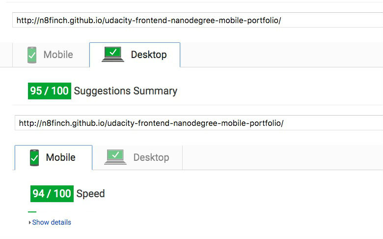

All the files I worked on are in the `dev` folder and gulp task runner refines everything to `dev > dist`. Then I basically copy the dist contents to the main root, because the `clean` task cannot run outside the working directory. 

# What I changed

## Added Gulpfile.js and plugins

Added gulp for taskrunning, namely:
    
- html, css and js minification
- concat js files
- reducing image size
- delete/clean current files so new minifications weren't concatinated
    
## Index.html
 
- redirected the stylesheets and scripts to .min files
- moved the styles and scripts below the footer
- async-ed the scripts.
- closed `div`

With everything minified, results were good:



## All images

- resized and compressed

## main.js (in views)

heavily referenced: https://github.com/aricept/frontend-nanodegree-mobile-portfolio/tree/master/src/views/js

- changed all uses of `querySelector` to `getElementById`
- changed all uses of `querySelectorAll` to `getElementsByClassName`
- Collapsed `changeSliderLabel()` and `sizeSwitcher()` to avoid running through 2 switch statements
- Pulled dx and newwidth declaration out of the loop, and pulled the `offsetWidth` checks out of `determineDx()` and into `changePizzaSizes()` to avoid multiple layout operations.
-  Wrapped the loop in a `requestAnimationFrame()`, allowing the browser to draw when ready.
- Moved variable declarations out of the loop whenever possible.
- Moved the scrollPos declaration to a separate function, and tied that to the event listener.
- `requestAnimationFrame` to allow the browser to time frames
- Moved the animation technique from `style.left` to `style.transform = translateX()`, which does not affect layout, removing a costly step from the render process.
- Limited pizza creation to the visible screen only, minimizing the number of elements we need to animate


======Original README==========

## Website Performance Optimization portfolio project

Your challenge, if you wish to accept it (and we sure hope you will), is to optimize this online portfolio for speed! In particular, optimize the critical rendering path and make this page render as quickly as possible by applying the techniques you've picked up in the [Critical Rendering Path course](https://www.udacity.com/course/ud884).

To get started, check out the repository, inspect the code,

### Getting started

####Part 1: Optimize PageSpeed Insights score for index.html

Some useful tips to help you get started:

1. Check out the repository
1. To inspect the site on your phone, you can run a local server

  ```bash
  $> cd /path/to/your-project-folder
  $> python -m SimpleHTTPServer 8080
  ```

1. Open a browser and visit localhost:8080
1. Download and install [ngrok](https://ngrok.com/) to make your local server accessible remotely.

  ``` bash
  $> cd /path/to/your-project-folder
  $> ngrok http 8080
  ```

1. Copy the public URL ngrok gives you and try running it through PageSpeed Insights! Optional: [More on integrating ngrok, Grunt and PageSpeed.](http://www.jamescryer.com/2014/06/12/grunt-pagespeed-and-ngrok-locally-testing/)

Profile, optimize, measure... and then lather, rinse, and repeat. Good luck!

####Part 2: Optimize Frames per Second in pizza.html

To optimize views/pizza.html, you will need to modify views/js/main.js until your frames per second rate is 60 fps or higher. You will find instructive comments in main.js. 

You might find the FPS Counter/HUD Display useful in Chrome developer tools described here: [Chrome Dev Tools tips-and-tricks](https://developer.chrome.com/devtools/docs/tips-and-tricks).

### Optimization Tips and Tricks
* [Optimizing Performance](https://developers.google.com/web/fundamentals/performance/ "web performance")
* [Analyzing the Critical Rendering Path](https://developers.google.com/web/fundamentals/performance/critical-rendering-path/analyzing-crp.html "analyzing crp")
* [Optimizing the Critical Rendering Path](https://developers.google.com/web/fundamentals/performance/critical-rendering-path/optimizing-critical-rendering-path.html "optimize the crp!")
* [Avoiding Rendering Blocking CSS](https://developers.google.com/web/fundamentals/performance/critical-rendering-path/render-blocking-css.html "render blocking css")
* [Optimizing JavaScript](https://developers.google.com/web/fundamentals/performance/critical-rendering-path/adding-interactivity-with-javascript.html "javascript")
* [Measuring with Navigation Timing](https://developers.google.com/web/fundamentals/performance/critical-rendering-path/measure-crp.html "nav timing api"). We didn't cover the Navigation Timing API in the first two lessons but it's an incredibly useful tool for automated page profiling. I highly recommend reading.
* <a href="https://developers.google.com/web/fundamentals/performance/optimizing-content-efficiency/eliminate-downloads.html">The fewer the downloads, the better</a>
* <a href="https://developers.google.com/web/fundamentals/performance/optimizing-content-efficiency/optimize-encoding-and-transfer.html">Reduce the size of text</a>
* <a href="https://developers.google.com/web/fundamentals/performance/optimizing-content-efficiency/image-optimization.html">Optimize images</a>
* <a href="https://developers.google.com/web/fundamentals/performance/optimizing-content-efficiency/http-caching.html">HTTP caching</a>

### Customization with Bootstrap
The portfolio was built on Twitter's <a href="http://getbootstrap.com/">Bootstrap</a> framework. All custom styles are in `dist/css/portfolio.css` in the portfolio repo.

* <a href="http://getbootstrap.com/css/">Bootstrap's CSS Classes</a>
* <a href="http://getbootstrap.com/components/">Bootstrap's Components</a>
